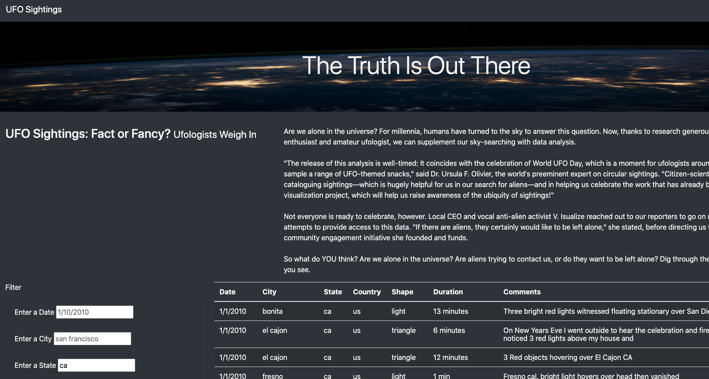
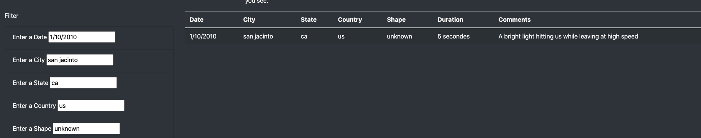

# UFO
Author: Jerome Simmons

## Overview of Project
Using a data set of UFO sightings, we've created a html5 webpage and used Javascript notation to build a dynamic table to filter UFO sighting data on the webpage. The table has 5 filters upon which we can review the data, and allows visitors to review UFO accounts from 1/1/2010 - 1/13/2010. Only the visitor can determine whether or not extraterrestrials are real...

## Results
A user can filter through the UFO sightings by inserting data into any or all of the table filters. The dataset only contains 112 entries, so users should expect limited results when using the filters. Below are the 5 filters with a few guidelines & notes and we've walked through two examples in the "Examples" section below.
* Date (MM/DD/YYYY): data set only contains values from 1/1/2010 - 1/13/2010
* City (lower case): diverse range of cities
* State (lower case): 35 states
* Country (lower case): us only
* Shape (lower case): diverse range of shapes

### Examples
If the visitor would like to search UFO sightings in the state of California, the visitor would type "ca" into the State filter. The table will automatically filter for all UFO sightings in the State of California.

If the visitor would like to filter further into California, the visitor can enter more search fields as shown below.

## Summary
Overall, this webpage provides a means for users to filter through a lot of information. However, there are a few major pain points that would need to be addressed in future iterations on the page.
1. The filters must match the dataset exactly, which makes filtering very challenging. If a user typed "CA" instead of "ca", the user would not receive a result.
2. The filters must be typed, which leads to incomplete results for users who lack experience with the dataset. If a user begins filtering the data by city, the user will probably not receive a result.

In order to fix these issues in a future iteration, we should enable the code to match text regardless of case. This would reduce confusion on behalf of users who want to read about UFO sightings from their home state. Additionally, for filters with limited values such as "shape" or "state", we need to introduce a drop down menu, so visitors can more easily find search results.
